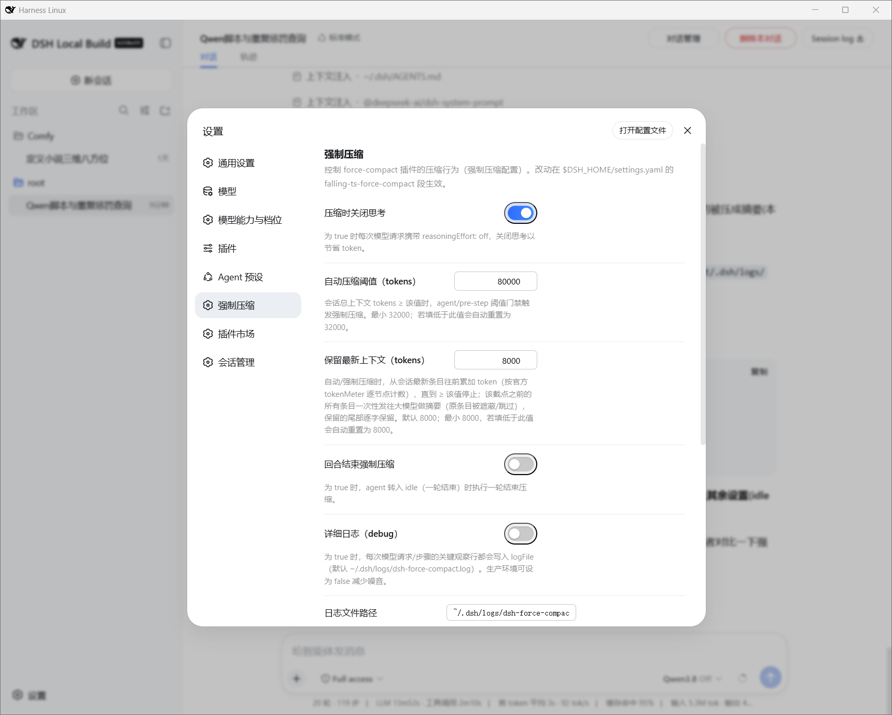

# dsh-force-compact

**Aggressive, local-first context compaction for DeepSeek Harness agents.**

A DSH **Cordis function plugin** that keeps the agent's working context lean *by design*, so you
can deliver a **large-window experience** against a self-hosted llama.cpp serving `Qwen3.8‑27B`
at modest context — no API cost, no data egress.

[中文](README.cn.md)

---

## Why

Most harness setups bolt a big frontier model onto a short context budget. This plugin makes
the opposite bet: **you own the weights, the endpoint, and the context budget.**

- **Self-hosted inference.** Point the agent at a local OpenAI-compatible llama.cpp server
  running `Qwen3.8‑27B` (GGUF / NVFP4 / MTP variants all work through the standard DeepSeek
  adapter path — no separate llama.cpp adapter needed).
- **Low context, high signal.** Rather than fight a small hard cap, the plugin **shrinks the
  conversation itself**, so the agent reasons over a tight, high-signal prompt while effectively
  reaching a much larger working memory.
- **Thinking-off for compactions, passthrough for everything else.** `disableThinking: true`
  (default) turns off reasoning effort on **this plugin's own compaction summarization call**
  only. All other model requests (business conversation, sub-agents, tool-driven, other
  plugins) ride the machine's own configuration unchanged — the plugin no longer blanket-stamps
  them (2026-08 semantics revision, see "Thinking control: scoped to compactions" below).
- **Private & free.** No per-token billing, no egress, and the exact model/context tradeoff is
  yours to dial.

---

## What it does

Two compaction engines coexist behind one facade (`resolveCompaction`), transparent to callers:

| Engine | Used when | Notes |
|--------|-----------|-------|
| **Official** | `compaction` service is resolvable in the agent realm | Preferred; delegates to `compaction/basic`. |
| **Builtin** | Automatic fallback when the service is realm-isolated (typical standard preset) | Self-contained persistent transaction using only `ctx.sessions` / `ctx.llm.stream` / `ctx.tokenMeter`. Reuses the official `compaction/*` event vocabulary, so it survives cross-build replay with no `ignorable` hacks. |

You never toggle — official wins when reachable, builtin takes over otherwise.

### Trigger points

- **Per-request guard (`agent/pre-step`)** — reads the session's *projected* context tokens
  (the exact number the harness renders bottom-right, provider-anchored). At
  `autoThresholdTokens` it rejects the outgoing request and compacts the head instead, retaining
  the latest `retainLatestTokens` verbatim.
- **Turn-end / idle (`agent/status` → `idle`)** — when the agent quiesces, optionally compacts
  via `compactNow` (gate: `turnEndForceCompactionEnabled`).
- **Manual `/force-compact`** — immediate `compactNow` when idle; queues a process-local force
  flag consumed at the next model step when busy. **Loaded lazily:** the command is only
  registered at the first guarded-listener activation, so a fresh session sees it in the `/`
  picker *after its first model request* (see "Behavior notes").
- **`session/flush`** — the awaited durability checkpoint.

Every path funnels into the single *"compaction result landed in the session"* boundary — the
same point where the live-UI signal fires.

### Provider-anchored decisions

Decisions key off `projectedTokens` (same figure shown in the UI corner), so the plugin never
drifts from what you see. Threshold-aware shrink gates skip summarizer calls that provably could
not pull the session below the threshold (kills the low-threshold dead loop).

### Meter-aligned shadow-price billing

The builtin transaction bills `shadowedTokenCount` from the **same** `tokenMeter.measure`
per-node prices the official engine uses, so the meter's collapse protocol settles the drop
correctly — the bottom-right counter goes *down* after compaction instead of drifting upward.

### Thinking control: scoped to compactions

Since the 2026-08 semantics revision, `disableThinking` controls **one thing**: whether
*this plugin's own compaction summarization call* carries `reasoningEffort:'off'`. Everything
else is passed through untouched:

| Call site | Behavior with `disableThinking: true` |
|---|---|
| Plugin's builtin-engine summarization call (`engine/builtin.js` → `engine/summarizer.js` → `ctx.llm.stream`) | Carries `reasoningEffort:'off'` |
| Every **other** model request — business conversation, sub-agent delegation, tool-driven calls, other plugins | Rides the machine's own `LlmCallConfig` **unchanged**; whatever `settings.yaml` / request header configured is honored |
| Official `compaction` service summarization calls | Not routed through any plugin seam — unaffected either way |

The former `agent/request` blanket stamp (which hit **every** business call while paradoxically
never reaching a single summarizer, because summarizers call `ctx.llm.stream` directly and
bypass the agent-loop seam entirely) is gone. `src/hooks/wire-rewrite.js` retains only its
LiveUI watermark role; it no longer attempts any wire manipulation at the `llm/stream`
seam.

However, when the summarizing call targets a **llama.cpp / OpenAI-compatible endpoint**
(the `thinking: { type: 'disabled' }` field the adapter produces from
`reasoningEffort:'off'` is silently ignored by llama.cpp's OAI parsing path), the
summarizer ALSO stamps the llama.cpp-native top-level wire field
`reasoning_effort: "none"` — gated on the exact same scoping rule as the
camelCase `reasoningEffort` twin (only when `extra.reasoningEffort === 'off'`, i.e.
when `settings.disableThinking` is on). One options object now carries BOTH wire
fields simultaneously, covering both endpoint families:

| Endpoint family | Reads | Result |
|---|---|---|
| Real DeepSeek API | `reasoningEffort:'off'` (camelCase) → serialized to `thinking:{type:'disabled'}` | Thinking disabled ✅ |
| llama.cpp / OAI-compatible | `reasoning_effort:"none"` (snake_case top-level) → parsed natively | `enable_thinking=false` ✅ |

Unknown top-level keys are tolerated-but-ignored by each endpoint family, so emitting
both is harmless cross-family. The wire field is added in
`src/engine/summarizer.js` (immediately before `llm.stream(options)` is called), NOT
in the `llm/stream` waterfall listener — a historical draft attempted injection there
but proved ineffective structurally (intermediate-layer waterfall returns are discarded;
in-place seed mutation crashes the host). See the
`src/hooks/wire-rewrite.js` module header for the full write-up.

If you need thinking off on **business calls** too (not just compaction), configure
your provider's own `reasoningEffort` at the request-header level — the plugin
deliberately stays out of that decision.

#### Observability: per-attempt audit lines

Every summarization attempt emits **two** `[force-compact]` diagnostic lines to the
plugin log (visible at the default `debug: true`), so you can verify the scoping
decision and the exact wire fields **without capturing network traffic**:

```
[force-compact] <sessionId>: compaction thinking-policy — settings.disableThinking=true → extra.reasoningEffort='off' (this summarization call carries thinking-OFF)
[force-compact] <sessionId>: summarization wire-fields → <provider>/<model>: reasoningEffort='off' + reasoning_effort="none" (llama.cpp-native wire field)
```

- **Line 1** fires where the `disableThinking` setting is read and routed into the call
  options (`engine/builtin.js`). With the setting off it instead records that the call
  *rides the machine default*.
- **Line 2** fires at the llama.cpp-compatibility stamp site (`engine/summarizer.js`),
  recording **both** wire fields exactly as they leave the options object plus the
  resolved provider/model — the durable answer to “did thinking-off actually land on
  the wire?”. Fields that were not stamped are explicitly labeled `(absent…)`.

The wire claim is empirically grounded, not just spec: probed against a local
llama.cpp OpenAI-compatible endpoint (`Qwen3.8‑27B`), a baseline request **without**
`reasoning_effort` returned a populated `reasoning_content` (the model thinks by
default), while the identical request carrying top-level `reasoning_effort:"none"`
returned **no** `reasoning_content` at all — i.e. the field genuinely disables thinking
on such endpoints, and business calls (which omit the field) keep thinking as usual.

### Live-UI status

A tiny host→client messenger (a `liveUi` settings field mirrored live to the browser) paints a
badge beside the turn:

- **🟥 compressing** — pinned red `[强制压缩中>>>]`, fired just before a compaction commits;
- **🟢 done** — pinned green `[压缩完成!]`, fired the instant a compaction result lands; 3 s
  later a fresh random "working" pair takes over;
- **🔵 working** — otherwise a playful random one-liner ("正在缝合上下文…", "正在憋大招…").

Publishers are fail-safe: a messenger glitch can never disturb the actual compaction.

---

## How it works

```
agent/request(payload, next)              # every model request
    return await next()                  # pure pass-through (2026-08 semantics
                                         # revision: disableThinking scopes ONLY to
                                         # the plugin's own compaction summarizer)

agent/pre-step(payload, next)             # before each model step
    projectedTokens >= autoThresholdTokens?
        no  -> next()                     # let the model request proceed
        yes -> compactRegion(head-before-retainLatestTokens, signal)
              return { kind: "reject" }   # no model request this step

agent/status({ agent, status })          # lifecycle transition
    status === "idle" && turnEndForceCompactionEnabled?
        -> compactNow(agent, freshSignal) # turn-end compaction

session/flush(session)                   # durability checkpoint
    select region -> project messages -> preview + shrink gate
    -> compaction.compactRegion(start, end, agent, signal)
```

Supporting modules:

- `src/hooks/guard.js` — per-request guard: `agent/request` pure pass-through (no more
  blanket thinking stamp) + `pre-step` threshold gate + process-local force flag
  (`thinkingDisabled` survives only as a legacy predicate, un-called on the hot path).
- `src/hooks/command.js` — the `/force-compact` command (lazily registered; see "Behavior notes").
- `src/hooks/idle.js` — turn-end forced compaction.
- `src/hooks/wire-rewrite.js` — the `llm/stream` Live-UI watermark hook (no longer performs
  wire manipulation; see module header for the historical note on why).
- `src/engine/region.js` — head/tail-anchored region selection (with the official pairing ledger).
- `src/engine/summarizer.js` — the one-shot LLM summarizer (fully aligned with official
  `compaction-basic`: target resolution, prefix-cache alignment, `purpose:'compaction'` tag,
  fail-closed finish classification, usage capture).
- `src/engine/builtin.js` — the builtin persistent transaction (official `compaction/*` vocab).
- `src/engine/checkpoint.js` — preview + shrink gate + delegation to the compaction service.
- `src/core/projected.js` — provider-anchored `projectedTokens` reading.
- `src/core/ui-signal.js` — the live-UI messenger.

---

## Install

As an installable bundle (recommended):

```sh
# from npm (published):
npm install @falling-ts/dsh-force-compact
# from git:
dsh plugin --profile web add github:falling-ts/dsh-force-compact
# from a local checkout:
dsh plugin --profile web add ./dsh-force-compact
```

Or, from a local checkout, as a `--patch` overlay without installing:

```sh
dsh web --patch dsh-force-compact/cordis.patch.yml
```

Plugin loaded ⟺ `~/.dsh/logs/dsh-force-compact.log` gains:

```
[force-compact] debug logging enabled — writing [force-compact] lines to <absolute path>
```

Verify a compaction happened:

```
idle compaction (builtin) shadowed N nodes (~M tokens)
builtin compaction OK — replaced span seq[A..B] (N nodes, ~K tokens) with a P-char checkpoint
compaction thinking-policy — settings.disableThinking=true → extra.reasoningEffort='off' (…)
summarization wire-fields → <provider>/<model>: reasoningEffort='off' + reasoning_effort="none" (…)
```

(The last two lines are the per-attempt audit pair described under
“Observability” — they prove the thinking-off decision and its wire fields for that
exact attempt.)

---

## Settings

`$DSH_HOME/settings.yaml`, namespace `falling-ts-force-compact`:

| key | type | default | meaning |
|-----|------|---------|---------|
| `disableThinking` | boolean | `true` | When `true`, **only** the plugin's own compaction summarization call carries `reasoningEffort:'off'`. All other model requests ride the machine's config unchanged (2026-08 semantics revision — see "Thinking control: scoped to compactions" above). |
| `autoThresholdTokens` | number ≥ 32000 | `32000` | Projected-token trigger for the per-request gate. Lower ⇒ more aggressive. **Floor 32000** (stored values clamp back up at read time). |
| `retainLatestTokens` | positive int ≥ 8000 | `8000` | Retain the latest N tokens verbatim; send everything older to the summarizer in one batch. **Floor 8000.** Drives both the auto gate and the `/force-compact` path. |
| `turnEndForceCompactionEnabled` | boolean | `true` | Compact on the agent's `idle` transition. |
| `debug` | boolean | `true` | Emit `[force-compact]` diagnostics to the plugin log. |
| `logFile` | string | `~/.dsh/logs/dsh-force-compact.log` | Diagnostics destination (`~` expands to home dir). |
| `compactionMode` | `'realm' \| 'global'` | `'realm'` | Official-service resolution strategy (priority-1 path). |
| `builtinEnabled` | boolean | `true` | Gate for the builtin engine fallback. |
| `maxSummaryTokens` | integer (1024–200000) | `1024` | Cap on the summarizer LLM `maxTokens`. |

Example — an aggressive **local** profile:

```yaml
falling-ts-force-compact:
  disableThinking: true
  autoThresholdTokens: 40000   # compact sooner ⇒ keep the live prompt small
  retainLatestTokens: 8000
  turnEndForceCompactionEnabled: true
```

When the `settings` service is absent, the plugin falls back to the same defaults and still
compacts — the namespace is optional, never a hard dependency.

---

## Screenshots



*Settings panel — `设置 > 强制压缩`. All nine fields above can be edited live without restart.*

![Live conversation — red "[forced compacting>>>]" badge pinned beside an in-flight turn](assets/live-conversation.png)

*Conversation page — the live-UI signal paints three states (🟥 compressing / 🟢 done / 🔵 working);
the green banner fades after ~3 s back to a random "working" line.*

### Tuning for low-context llama.cpp

Serve `Qwen3.8‑27B` with a comfortable-but-modest context and let the plugin decide the
effective window: keep `autoThresholdTokens` comfortably **below** the served context so the
live prompt stays small and latency flat, while the agent retains deep memory through the
compressed head. Pressure is measured in *projected* tokens (provider-anchored), so the
threshold maps predictably onto what the UI shows you.

---

## Behavior notes

- **Runtime dependency:** the `compaction` service (preset plane `agent-presets:compaction-basic`).
  Read live via `ctx.get('compaction')`; when unreachable the forced-compaction path falls
  through and lets the request proceed.
- **Optional dependencies:** `settings` / `tokenMeter` / `commands` / `llm` / `agents` are read
  via `ctx.get(...)` with guards — a missing one degrades gracefully rather than crashing.
- **`/force-compact` is loaded lazily (one model request first).** The `commands` service
  arrives with the agent-presets plane — **after** the plugin's boot-time `apply` — so
  boot-time registration would always miss. Registration is therefore retried at the top of
  every guarded listener (`agent/request` / `agent/pre-step` / `agent/status` /
  `session/flush`) and the first success settles the latch permanently. Practical effect:
  after (re)starting the instance, a **fresh session's `/` command picker does NOT show
  `/force-compact` until that session makes its first model request** — send any one
  message and the command is registered process-wide, then available in every session.
  Success logs `[force-compact] /force-compact command registered (deferred)`; if the
  `commands` service never materializes, a single `… still UNREGISTERED 10 min …` warn
  explains the empty picker. Until it registers, the rest of the plugin works normally —
  self-healing degradation, not an install failure.
- **Per-request settings read:** parameters are read per model request, so edits take effect on
  the next request without a restart.
- **Signals:** the `agent/*` Waterfalls forward the current turn's signal; the `session/flush`
  checkpoint and the `agent/status` idle listener each mint a fresh `AbortController`.
- **Persistence:** the durable output is the `compaction/*` bracket events + a
  `surfaceOp:replace` `user/message` checkpoint, replay-safe across builds.
- **Client half:** `web/client.js` adds a Settings section "强制压缩 / Force Compact" for
  editing these values live (uSES-safe mirror, no timers/state).
- **One intentional timer:** the 3 s `publishDone` fallback (presentation-only, documented
  deviation). Otherwise the plugin is pure listeners + a process-local `Map` force flag.

---

## License

MIT (see LICENSE).
